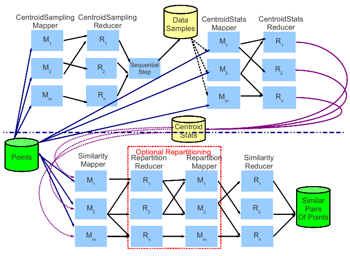
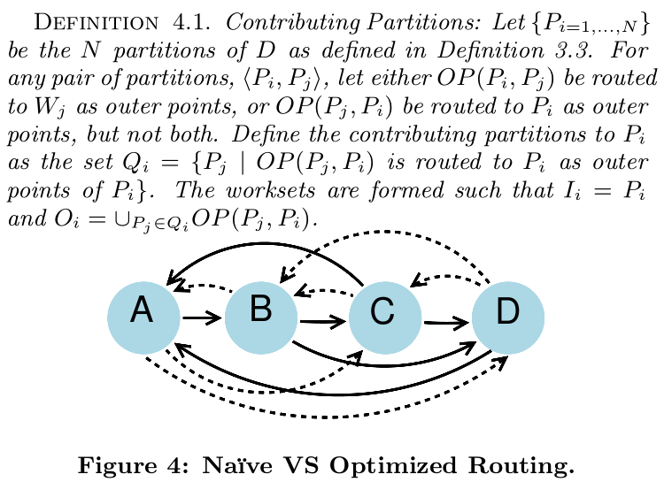
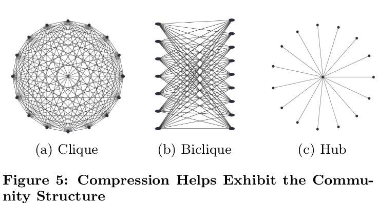

# Scalable-All-Pairs-Similarity-Search-in-Metric-Spaces

Reimplement experiment part of the paper 
[Scalable all-pairs similarity search in metric spaces](https://dl.acm.org/doi/10.1145/2487575.2487625)


## 论文内容简介

- 文章提出了 MR-MAPSS (MapReduce-based Metric All Pair Similarity Search)。这种方法可以用来计算某一数据集上的所有相似对，并具有以下优势：
- 每一数据对最多被计算一次，因而大大简化了计算量；
- 采取一种新的压缩策略，优化数据的输出格式，减少数据的输出大小；
- 可以处理数据倾斜的问题，合理分配计算任务。




- 如上图所示：论文年提出的方法主要包括四个 MapReduce 的过程，列出如下：
   1. CentroidSampling：属于数据预处理阶段的第一个 MapReduce 过程。从数据集中选择任意的数据点作为中心点。
   2. CentroidStats：属于数据预处理阶段的第二个 MapReduce 过程。计算与划分相关的数据信息，即计算每个中心点每个中心点所在的划分的半径。
   3. Similarity：根据数据集和前两个 MapReduce 过程得到的信息计算数据集的所有相似对。
   4. Repartition：可选的 MapReduce 过程，将 Similarity Reducer 阶段过大的工作集进一步划分为更小的工作集，充分利用集群资源，减少时间开销。

## 实验内容

- 分析算法内容，列出算法的具体伪代码实现，并进行实际的代码实现

- 变量解释
   - D 数据集
   - pi 数据集中的第i个点
   - ci 数据集中的第i个中心点
   - Pi 第i个划分
   - Wi ci所在的工作集
   - Ii Wi的内点集合
   - Oi Wi的外点集合
   - ri Ii的半径
   - pointType 数据点的类型，外点或内点
   - t 相似对的阈值
   - dist() 两点间的距离
   - SimSet() 集合上的所有相似对

- getDataset Mapreduce 基本算法

```

	input: 20个以电影ID为文件名的文件的每一行评分记录<UserID, rate>
    output: <UserID, rate-of-20-movies>
   
    Map:
    for line in record do
        输出 <UserID, MovieID+rate>

	shuffle 按照用户名将每个用户的观影评分发到一个reducer

    Reduce:
    初始化 score = '0' * 20
    对于每条评分记录，在score对应位置改为分数
    数据平均值补全处理
    
    输出 <UserID, score>
    

```

- CStats MapReduce 基本算法

```

	input: 按行读入用户评分记录，中心点
    output: 每个中心点及其半径

	Map：
    for UserID, score in record do
        求出距离最近的中心点
        输出 <中心点的index，最小距离>

    shuffle: 每个中心点的inner点到中心点的距离传入同一reducer

	Reduce:
    radius = inner点到中心点的距的最大距离
	输出 <中心点向量，raduis>


```

- similarity MapReduce 基本算法

```

	input: D; centroid statistic.
	output: SimSet(D, D).
	
	Map:
	for pi in D do
		if dist(pi, ci) = min{dist(pi, cj)}，则将 pi 标志为 Wi 的内点;
		else if dist(pi, ci) <= r + t，则将 pi 标志为 Wi 的外点;
	output 格式为 [<ci, <pi, pointType, dist(pi, ci)>>];
	
	shuffle 过程依据 secondary key 即 pointType 的值将所有内点先于所有外点送入对应的工作集中
	
	Reduce:
	for pi in Ii do
		for pj in Ii do
			if dist(pi, pj) <= t, 输出相似对(pi, pj);
	for pi in Oi do
		for pj in Ii do
		if dist(pi, pj) <= t, 输出相似对(pi, pj);

```

- 优化1：Exploting Commutativity
- 定义 OP(Pi, Pj) = {a | a ∈ Ii ∧ a ∈ Oj}
- 在 Similarity Mapper 上进行优化，或将 OP(Pi, Pj) 或送入 Wj 作为外点，或将 OP(Pj, Pi)送入 Wi 作为外点，但不都做。通过这种优化，每个点对最多在一个工作集中进行比较，而之前可能最多在两个工作集中进行比较。



- similarity Mapper 优化算法

```

	input: pi; P.
	ouput: [<ci, <pi, pointType>>].
	Pi = getpartition(pi, partitionset)
	for Pj in partitionset do
		if Pi.id == Pj.id
			输出(<Pi, “inner”, <pi, “inner”>>)
		else if (((Pi.id + Pj.id) is odd) XOR (Pi.id < Pj.id)) && dist(pi, cj <= (rj + t))
			输出(<Pj , “outer”, <pi, “outer”>>)

```

- 优化2：Compression of Pairs
- 在 Similarity Reducer 上进行优化，利用邻接表的结构将形如[(a, b)(a, c)(a, d)(a, e)]这样的相似对转变为[a, (b, c, d, e)]这种格式进行输出。通过这种优化，可以有效减少数据的输出大小。



- similarity Reducer 优化算法

```

	EmitSimSet
	input: Pa: 初始为innerTree(只包含inner点的层次聚类树); Pb: 初始为Tree(包含inner&outer点的层次聚类树).

	output: SimSet(Pa, Pb).

	def EmitSimSet(self, Pa, Pb):
		if isAndEmitBiClique(Pa, Pb):
            	pass
    		else:
        		if MayHavePairs(Pa, Pb):
            		if Pa.hasChild():
                		EmitSimSet(Pa.left, Pb)
                		EmitSimSet(Pa.right, Pb)
            		elif Pb.hasChild():
                        EmitSimSet(Pa, Pb.left)
                		EmitSimSet(Pa, Pb.right)
            		else:
                		EmitAdjLists(Pa, Pb)

	只需要在两棵树之间寻找符合格式的similar pairs而不用在树内寻找（已被树间包含） 

```

- repartition MapReduce 基本算法

```

	ProcessInnerPoint
	input: worksetInfo array, 包括了中心点和他们的半径信息; point: 待处理的内点
	output: point 及其 pointType
	将 point 作为其最近的工作集 Wi 的内点输出;
	for Wj in worksetinfo do
		if dist(point, Wj) <= rj + t && i ≠ j
			将 point 作为 Wj 的外点输出

```

## hadoop集群部署

- 配置主机名，安装 SSH，设置免密登录。
- 配置 Java 环境。
- 安装配置 zookeeper，设置 hadoop1 和 hadoop2 为 zkfc。
- 安装配置 hadoop，设置 hadoop1 & 2 为 namenode，同时设置五台机器均为 journalnode 和 datanode。
- 安装配置 yarn，设置 hadoop1 为resourcemanager，五台机器均为 nodemanager。

问题记录：
- 在配置主机名时，需要一并修改服务器的名称。
- 在机器挂掉之后，重启机器进入 standby 状态，需要重启整个集群才能恢复工作。

## 数据集选择

- 这里我们选择了和论文作者一样的 Netflix 数据集，选取评分人数最多的20部电影，整理得到一个可用的数据集。这个数据集中，每一行记录由用户的 id 和一个20维的向量组成，20维的向量代表了该用户对此20部分电影的评分（1~5）。
- 该数据集共421144条数据，70.5 MB，论文作者采用了500台机器的集群进行试验。因为数据集过大，因此我们对数据集进行了两个数量级的削减，采用3000条数据的数据集进行实验。

## 实验结果记录及分析

- 首先是无优化算法下的结果

- result 1
- 这里研究了不同中心点数量对于运行时间和结果的影响。
- 一般来说，中心点数量越多，运行时间越长，但由于中心点数量增加的同时每个工作集的大小减少，因此时间的增加量并不大。
- 这里的结果与论文基本符合。
- 同时，在无优化的情况下，相似对可能被计算最多两次，因此此时的输出结果存在冗余，即输出数量在相似对真实数量的1-2倍之间。

|num of centroids|threshold|runtime|output size|
|----------------|---------|-------|-----------|
|100|3|58min32s|103024 pairs|
|300|3|1h28min25s|107586 pairs|
|500|3|1h44min33s|103604 pairs|

- result 2
- 这里研究了不同阈值对于运行时间和结果的影响。
- 一般来说，阈值越小，得到的相似对数量越少，运行时间越短。
- 这里的结果与论文结果基本符合。

|num of centroids|threshold|runtime|output size|
|----------------|---------|-------|-----------|
|100|3|58min32s|103024 pairs|
|100|2|40min58s|1716 pairs|
|100|1|25min36s|17 pairs|

- result 3
- 对比 result 1，这里研究了研究了第一种优化对于时间和输出结果的影响。
- 第一种优化去除了相似对计算过程中的冗余，因此输出结果的数量得到了一定的削减。理论上在选择不同的中心点数量的情况下，相似对的数量应保持不变，实验结果也符合这一预期。
- 由于避免了相似对的重复计算，运行时间也得到了一定的减少。

|num of centroids|threshold|runtime|output size|
|----------------|---------|-------|-----------|
|100|3|16min11s|62105 pairs|
|300|3|24min9s|62105 pairs|
|500|3|27min21s|62105 pairs|

- result 4
- 对比 result 2，这里研究了第一种优化对于时间和输出结果的影响。
- 可以看到，在选择阈值较大（2和3）的情况下，无优化的方法会产生较多的冗余，这一结果也符合我们的预期，即阈值越大，某一个点对越可能同时出现在两个工作集中进而进而被计算两次。

|num of centroids|threshold|runtime|output size|
|----------------|---------|-------|-----------|
|100|3|16min22s|62105 pairs|
|100|2|11min47s|1225 pairs|
|100|1|7min49s|17 pairs|

- result 5
- 这里对比了在第二种优化前后的结果，试图分析第二种优化对于时间性能和输出结果的影响。
- 可以看到，第二种优化算法虽然优化了输出的格式（形如[(a, b)(a, c)(a, d)(a, e)]这样的相似对转变为[a, (b, c, d, e)]这种格式，这种转变带来了输出行数的减少），但是由于这种优化算法的开销较大（需要多次递归），因此对性能造成了很大的影响。这一试验结果也基本符合我们的预期。

|num of centroids|threshold|runtime|output size|
|----------------|---------|-------|-----------|
|100|3|1min46s|6912 rows|
|100|3|19min5s|5772 rows|


- 在这里因为 Netflix 数据集的分布较为平均，在 similarity MapReduce 阶段，每个工作集的任务量大致相同，因此 repartition 部分并不能起到很好的结果，我们在前面列出了 repartition 部分的伪代码实现，没有进行 repartition 优化后的结果对比分析。